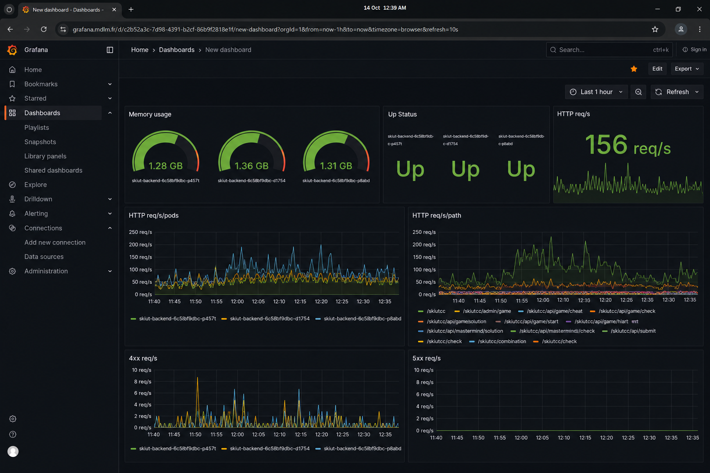
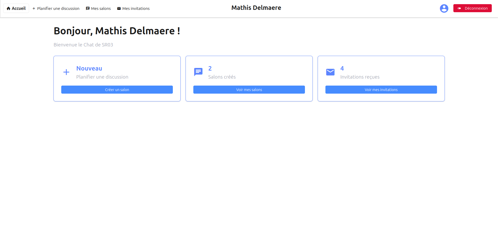
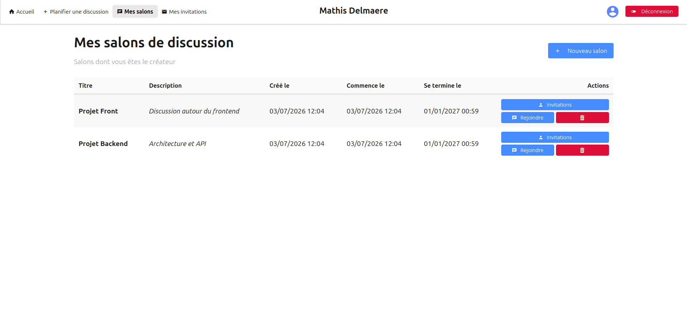
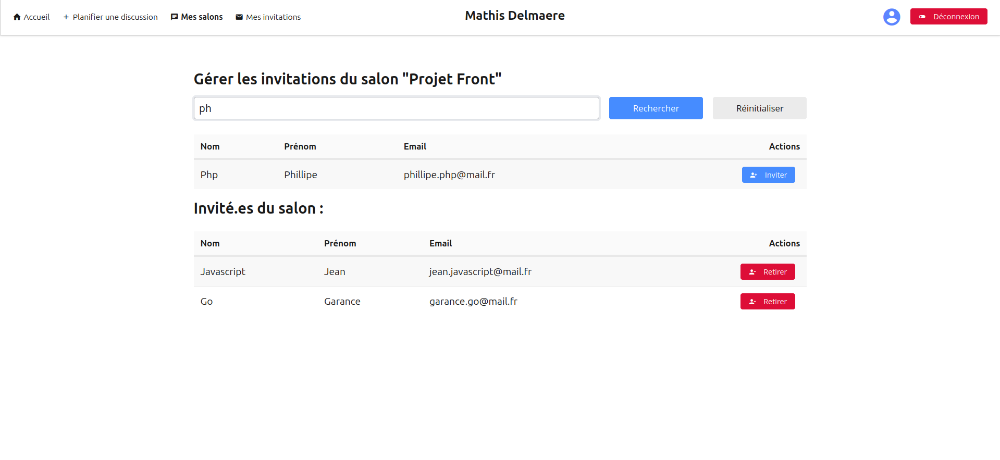
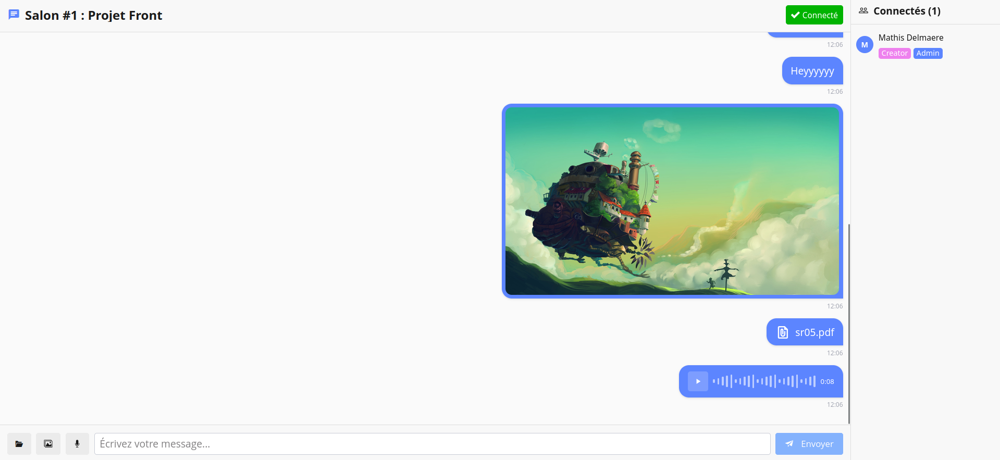
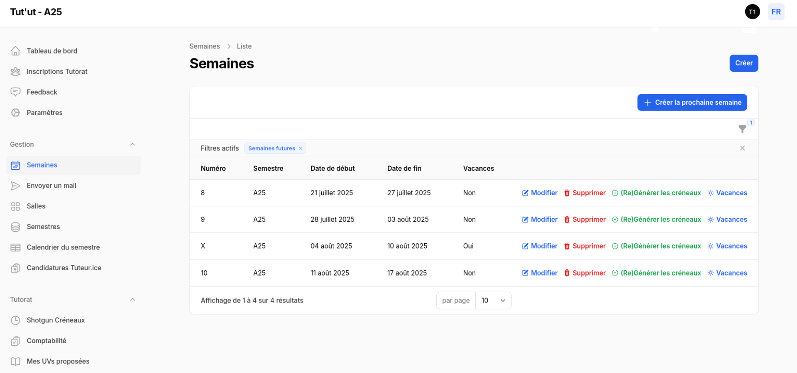
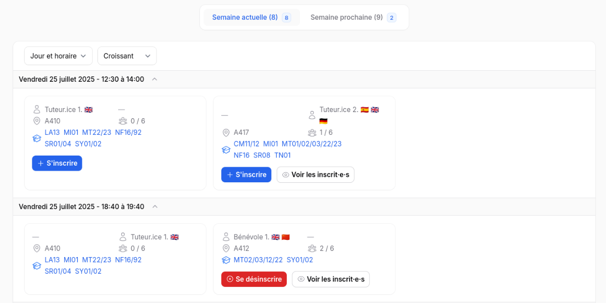
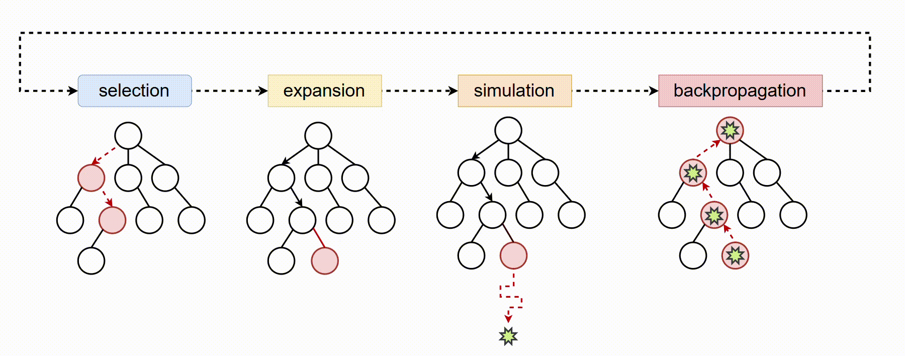
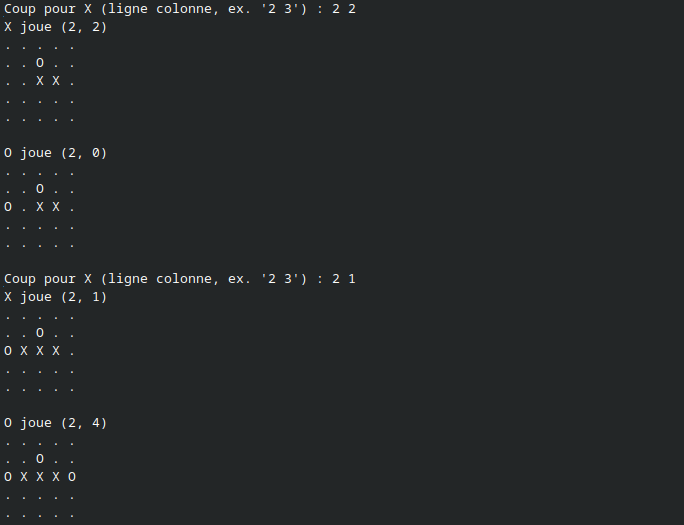
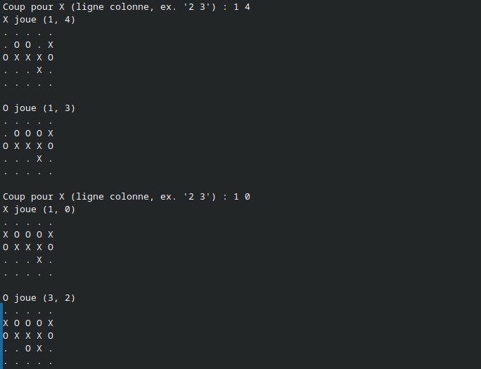

# Heyyyy, moi c'est Mathis Delmaere 👋

Salut ! Moi c'est **Mathis Delmaere**, étudiant en génie informatique à l'**Université de Technologie de Compiègne (UTC)**, filière **Ingénierie des Systèmes Informatiques (ISI)** (Promo 2022)

Je code majoritairement pour apprendre, découvrir de nouvelles technos et systèmes informatiques (que ça soit niveau backend, infra ou réseau), ou encore pour des associations de mon école.

> [!NOTE]
> Les projets présentés ici s'approchent majoritairement du développement web/full stack, car ce sont des projets qui sont plus simples à mettre en avant, mais aussi car c'est dans ce secteur que j'ai eu l'occasion de réaliser le plus de projets en cours ou dans les associations.
>
> Cependant, ma vraie passion réside dans les domaines suivants : Infra, Monitoring, Backend, SRE, DevOps
>
> Pour un exemple de projet plus concret dans ces domaines je t'invite à regarder mon homelab [mathisdlmr/k3s-project](https://github.com/mathisdlmr/k3s-project)

---

# Une petite intro ?

A peine âgé de 10 ans, je passais déjà mon temps à jouer à minecraft, aller dans le fameux `%appdata%` pour custom mon jeu, installer des modpacks initialement pas du tout compatibles, commencer à toucher à Java et aux VMs pour essayer de comprendre comment fonctionnait le jouer et comment il tournait sur un PC.

La suite logique était d'ensuite construire mon propre PC pour faire tourner un Minecraft boosté dessus, commencer à mettre Linux dessus parce que c'est cool, commencer à faire du développement, puis décider que j'allais faire ça toute ma vie.

Au cours de mon parcours associatif et académique je me serai vraiment éclaté avec le développement web/mobile, mais j'avoue que je ne m'amuse plus autant dans ce milieu qu'avant. Depuis que j'ai découvert le **DevOps**, **l'Infra**, les **deisgn patterns** pour des backends scalables et résilients, et plus globalement tous les enjeux liés au **SRE**, j'ai l'impression d'avoir trouvé un terrain de jeu bien plus imposant et intéressant que le simple développement.

---

# 💼 Expérience professionnelle

### Ingénieur SRE DevOps - [Padoa](https://www.padoa.fr) *(Stage)*

Infra & DevOps dans une scale-up française de santé au travail
- **Kubernetes/ArgoCD** : maintenance et évolution des clusters kubernetes multi-environnements
- **Monitoring** : Grafana, Prometheus, Thanos
- **CI/CD** : GitHub Actions et pipelines de déploiement
- **Go** : développement d'outils internes (tooling infra)

---

# 🏫 Vie associative à l'UTC

### Integ Fev *(Printemps 2023)*

Reprise, debug et mise à jour (nouvelles features, nouveau design) d'une app mobile **Flutter** et d'un backend **Laravel** pour une intégration de 1,5 semaine.
L'application a été utilisée par une ~100aine d'étudiant.e.s et servait essentiellement à proposer des animations et gérer l'organisation de la semaine d'intégration.

---

### Integ *(Automne 2023)*

Reprise, debug et mise à jour (nouvelles features, nouveau design) d'une app mobile **Expo** et d'un backend Laravel pour une intégration de 2 semaines.
L'application a été utilisée par >1000 étudiant.e.s et comptait encore plus de fonctionnalités que celle de l'integ fev : réservation de repas, file d'attente virtuelle, réservation de navette, scanner de QR code, etc.

_Ces screenshot sont issus de la version de l'application sur laquelle j'ai commencé à travailler, mais ce développement avait été effectué par Géo SAGLIO l'année précédent mon arrivée dans l'association_ 

---

### [Ski'UT](https://github.com/ski-utc) *(2024 -> 2025)*

Développement de A à Z (avec mon colocataire de l'époque, Eric BJARSTAL) d'une application mobile **Expo** et d'un backend **Laravel** pour gérer l'organisation d'un voyage au ski pour ~500 étudiant.e.s et proposer des animations tout au long de la semaine
* **Backend** [ski-utc/server-skiut-2026](https://github.com/ski-utc/server-skiut-2026) : Serveur Laravel/Filament pour toute l'organisation du voyage (réservations, planning, navettes…)
* **App mobile** : [ski-utc/app-skiut-2026](https://github.com/ski-utc/app-skiut-2026) : App Expo avec défis, planning, anecdotes, plan du domaine, navettes, notifications push, export/anonymisation RGPD, etc.

<a href="./files/skiut2025.pdf" download>Télécharger la présentation du projet</a>

---

### [Ski'UT V2](https://github.com/ski-utc) *(2025 -> 2026)*

Redéveloppement sur mon projet de l'époque, cette fois seul, pour stabiliser le projet et le rendre pérenne : 
* CI/CD sur le frontend et le backend
  * Dockerization + Pipeline de tests unitaires pour le backend
  * ESLint + Prettier pour le frontend 
* Déploiement du backend dans des containers docker auto-hébergés sur mon serveur kubernetes personnel
* Intégration de métriques et de traces dans le backend, récupérés par la suite par l'agent Alloy dans le cluster
* Rédaction de documentation pour expliquer le fonctionnement du projet et donner des bonnes pratiques à suivre

Le projet a par la suite entièrement tourné sur mon serveur kubernetes, et a tenu des pics de charge à >10k reqs/sec lors de certaines réservations à des évènements.
Pour çela le projet a grandement profité d'une infrastructure réseau mature avec Cloudflare -> Tunnel Cloudfalre -> Traefik in-cluster -> Load balancing sur 2 containers Docker avec un HPA en cas de grosse charge

---

### [Le Pic'Asso](https://github.com/picasso-utc) *(Printemps 2025)*

Bar et foyer étudiant de l'UTC dans lequel j'ai travaillé à la maintenance des systèmes informatique utilisés et au développement de nouvelles features pour les équipes de trésorerie et pour des animations

* **Ocktopus** [picasso-utc/ocktopus](https://github.com/picasso-utc/ocktopus) : Backend Laravel/Filament pour l'organisation de l'association et les services de trésorerie + API pour l'app mobile
* **Bach** [picasso-utc/bach](https://github.com/picasso-utc/bach) : Borne de paiement en React installée sur des Raspberry Pi, avec badgeuse NFC pour les cartes étudiantes et intégration Weezpay

TODO : screenshot des bornes

---

### [SiMDE](https://assos.utc.fr/simde/) *(Printemps 2025, Printemps 2026)*

Service Informatique de la Maison des Étudiants - hébergement et infra pour les >100 associations de la fédération BDE-UTC.

- **UTCats** : webapp Filament pour la gestion des CATs - [mathisdlmr/UTCats](https://github.com/mathisdlmr/UTCats)
- Debug et développement sur des projets d'infrastructure (majoritairement privés)
- Participation à la migration **nginx/Apache -> auto-hébergement k8s** pour passer d'applications uniquement en PHP vers du NodeJS

---

### [Le Pic'Asso](https://github.com/picasso-utc) *(Automne 2026 ?)*

Retour au Pic'Asso pour
* Refaire de la documentation,
* Remettre tous les projets à jours
* Effectuer la migration des raspberry 3 vers 5 utilisés pour les bornes de vente et écran de diffusion
* Développer de A à Z l'app mobile qui irait se brancher sur l'API du Backend : [mathisdlmr/app-pic](https://github.com/mathisdlmr/app-pic) : Application mobile du Pic'Asso, développée de A à Z

TODO : screenshot de l'app

---

# 📚 Projets de cours

> La grande majorité des repo embarquent Makefile et/ou Dockerfile. N'hésite pas à les essayer !

| Matière | Année | Projet | Description | Stack | Lien |
|---|---|---|---|---|---|
| **SR05, Systèmes répartis** | Printemps 2026 | Loup-garou distribué | Jeu du loup-garou décentralisé implémentant exclusion mutuelle distribuée et snapshots (horloges vectorielles) | `Go` | [mathisdlmr/sr05](https://github.com/mathisdlmr/sr05) |
| **SR03, Architecture des app web** | Printemps 2026 | Chat multi-utilisateurs en WebSocket| Application de chat avec panel admin, rooms temporaires, messages vocaux, photos et fichiers | `Spring Boot` · `React` · `WebSocket` | [mathisdlmr/sr03](https://github.com/mathisdlmr/sr03) |
| **TX, projets** | Automne 2025 | Plateforme de gestion | Webapp Filament pour le programme de tutorat de l'UTC | `Laravel` · `Filament` | [mathisdlmr/Tutut](https://github.com/mathisdlmr/Tutut) |
| **IA02, Résolution de Problèmes par algo** | Printemps 2025 | Résolution du Morpion par Algo | Implémentation d'un MCTS pour résoudre le problème du jeu du morpion | `Python` | [mathisdlmr/ia02](https://github.com/mathisdlmr/ia02) |
| **SR10, Introduction au dev web** | Printemps 2025 | Plateforme de recrutement | Webapp style LinkedIn - gestion d'offres, candidatures, organisations, avec rôles admin/recruteur/candidat | `Express.js` · `EJS` · `SQLite` | [mathisdlmr/sr10](https://github.com/mathisdlmr/sr10) |
| **SR04, Réseaux** | Automne 2024 | Travail de recherche | Recherche sur l'IoT pour la santé | `BLE` · `Zigbee` · `AMQP` · `MQTT` · `CoAP` | ... |
| **NF18, Conception de BDD (non-)relationnelles** | Printemps 2024 | Projet de BDD | BDD d'un aéroport en relationnel puis non-relationnel implémentée dans PostgreSQL | `PostgreSQL` · `Python` | [mathisdlmr/nf18](https://github.com/mathisdlmr/nf18) |
| **IC05, Analyse critique des données numériques** | Printemps 2024 | Scrapper de Letterboxd | Scrapper Letterboxd -> PostgreSQL puis nettoyage et analyse des données via Python | `Python` · `PostgreSQL` | [mathisdlmr/ic05](https://github.com/mathisdlmr/ic05) |
| **API Init, Introduction à Linux** | Automne 2023 | Space Invaders | Jeu Space Invaders dans le terminal | `Bash` | [mathisdlmr/Space-Invaders](https://github.com/mathisdlmr/Space-Invaders) |

---

### SR05

<a href="./files/sr05.pdf" download>Télécharger la présentation du projet</a>

---

### SR03

-> La majorité du projet porte sur la sécurité de l'application ainsi que l'utilisation de WebSockets.

---

### TX

  
  

TODO : ajouter des screens ici

---

### IA02

  

  
  

---

### SR04

<a href="./files/sr04-presentation.pdf" download>Télécharger la présentation du projet</a> | <a href="./files/sr04-rapport.pdf" download>Télécharger le rapport du projet</a>

---

### IC05

<a href="./files/ic05.pdf" download>Télécharger le rapport du projet</a>

---

_Au delà des cours dans le domaine de l'informatique, j'ai suivi de nombreux autres cours dans le domain des sciences cognitives ainsi que du lien entre technique et cognition. J'ai alors, en parallèle de mon diplôme de génie informatique, la mineure [PHITECO](https://sites.google.com/site/mineurphiteco/) (PHIlosophie, TEchnique et COgnition)._

> PHITECO propose des éléments scientifiques, philosophiques et pratiques pour comprendre la manière dont les technologies transforment nos façons de penser, de percevoir, de raisonner, d’agir et  d’interagir – bref, nos activités cognitives, telles qu'elles sont étudiées par les sciences cognitives et par la philosophie. Le mineur PHITECO permet ainsi à l'étudiant-ingénieur d'être introduit aux grands enjeux, théoriques et pratiques, des sciences cognitives

---

# 🚀 Hackathons

### CultureXP *(Février 2025 - GottaGoHack, Epitech)*

App mobile de gamification culturelle : carte de lieux culturels (via OpenStreetMap), quêtes, podcasts (via PodcastIndex), livres (via GoogleAPO), boutique d'achat avec l'XP. Un projet développé en 48h

**Stack** : `Expo` · `React Native` · `TypeScript`
-> [mathisdlmr/CultureXP](https://github.com/mathisdlmr/CultureXP)

<a href="./files/culturexp.pdf" download>Télécharger la présentation du projet</a>

---

### Aide-un-étudiant *(Juillet 2025 - UTC x mc2i)* - 🏆 1er prix

Plateforme d'entraide locale entre étudiants : prêt d'objets, échange de services, partage de connaissances. Pensée accessibilité et éco-conception (Server Components, requêtes Prisma optimisées, rendu statique, Score d'Impact Positif).

**Stack** : `Next.js` · `TypeScript` · `Prisma` · `TailwindCSS` · `NextAuth.js`
-> [mathisdlmr/hackhaton-utc-mc2i](https://github.com/mathisdlmr/hackhaton-utc-mc2i)

<a href="./files/aide-un-etu.pdf" download>Télécharger la présentation du projet</a>

---

# 🏠 Projets personnels

### k3s-project - Homelab k3s HA

Cluster k3s haute disponibilité déployé sur 3 Ordinateurs NUC

**Objectif** : apprendre les pratiques DevOps/SRE en conditions réelles, tout en hébergeant mes projets et en servant d'infra de secours pour les gros événements étudiants.

**Ce qui tourne dessus** : ArgoCD, Traefik, cert-manager, Cloudflared, Longhorn, Grafana, Prometheus, Loki, Alloy, Affine, Immich…

**Cas d'usage réel** : en janvier 2026, le cluster a hébergé le backend du mini-jeu de réservation Ski'UT, avec caching Cloudflare configuré à la main, pour absorber les pics à **10-15k req/s**. En temps normal le cluster héberge mes propres services de TodoList, Notion-Like (Affine), hébergement de photos (Immich), hébergement web...

-> [mathisdlmr/k3s-project](https://github.com/mathisdlmr/k3s-project)

---

# ⚙️ Stack & Technos

### Langages de programmation

### Frameworks & Bibliothèques Web

### DevOps & Infrastructure

### Observabilité

### Bases de données

### Cloud & Réseau

_Prochainement : Longhorn, ceph, Fluentd, kibana, tempo, victoria metrics_

---

# 📬 Contact

- 📧 **Email** : [mathis.dlmr@gmail.com](mailto:mathis.dlmr@gmail.com)
- 💼 **LinkedIn** : [linkedin.com/in/mathis-delmaere-6a6325325](https://www.linkedin.com/in/mathis-delmaere-6a6325325/)

---

Merci d'être passé·e par ici !
