# Hey there, I'm Mathis Delmaere 👋

** Available for a final-year internship starting February 2027**
> [!TIP]
> **Domains I'm looking for**
> - Infrastructure
> - SRE
> - Backend *(design patterns, resilience, scalability)*
> - DevOps

---

Hi ! I'm **Mathis Delmaere**, a computer engineering student at the **Université de Technologie de Compiègne (UTC)**, in the **Information Systems Engineering (ISI)** track (Class of 2022).

I code mostly to learn, explore new technologies and computer systems (backend, infra, or networking), or to build things for student associations at my school.

> [!NOTE]
> Most of the projects showcased here lean toward web/full-stack development, since they're easier to present and it's the area where I've had the most opportunities to work on projects, whether in class or through student associations.
>
> That said, my real passion lies in the following fields: **Infra, Monitoring, Backend, SRE, DevOps**.
>
> The project that best reflects this is my homelab, **[k3s-project](#flagship-project---self-hosted-kubernetes-homelab-k3s-project)**, detailed further down in this README.

---

## Table of Contents

- [A quick intro?](#a-quick-intro)
- [Professional experience](#professional-experience)
- [Flagship project - k3s Homelab](#flagship-project---self-hosted-kubernetes-homelab-k3s-project)
- [Student association life at UTC](#student-association-life-at-utc)
- [Coursework projects](#coursework-projects)
- [Hackathons](#hackathons)
- [Stack & Technologies](#stack--technologies)
- [Contact](#contact)

---

## A quick intro?

At barely 10 years old, I was already spending my time playing Minecraft, digging through the infamous `%appdata%` folder to customize my game, installing modpacks that were absolutely not meant to work together, and tinkering with Java and VMs to try to understand how the game worked and how it ran on a PC.

The logical next step was to build my own PC to run a souped-up Minecraft, install Linux on it because it's cool, start doing development, and then decide I'd do this for the rest of my life.

Throughout my time in student associations and academics, I've genuinely had a blast with web/mobile development, but I'll admit I don't enjoy it as much as I used to. Ever since I discovered **DevOps**, **infrastructure**, **design patterns** for scalable and resilient backends, and more broadly everything related to **SRE**, I feel like I've found a much bigger and more interesting playground than plain development.

---

##  Professional Experience

### SRE DevOps Engineer - [Padoa](https://www.padoa.fr) *(Internship: September 2025 → February 2026)*

Infra & DevOps work at a French occupational health scale-up.

- **Kubernetes / ArgoCD**: maintaining and evolving multi-environment Kubernetes clusters (staging/prod), managing GitOps deployments
- **Monitoring**: setting up and operating Grafana dashboards, Prometheus queries, long-term data aggregation with Thanos
- **CI/CD**: writing and maintaining GitHub Actions pipelines
- **Go**: developing internal infra tooling

### And a few other things...

* Academic support tutor in mathematics and computer science · UTC, Compiègne: September 2023 → June 2025
* Production line operator intern · Chanel, Compiègne: February 2023 → March 2023
* Freelance website development: January 2023 → March 2023

---

## 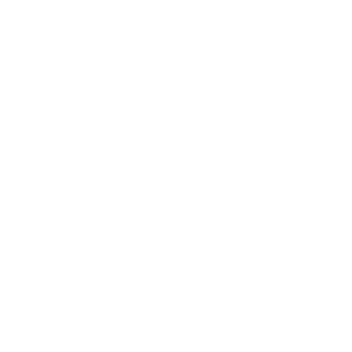 Flagship Project - Self-Hosted Kubernetes Homelab (k3s-project)

A **k3s** cluster I've been administering end-to-end since November 2025: this is the playground where I put everything related to infra, networking, and SRE into practice, and where I run several of the association projects presented below in production.

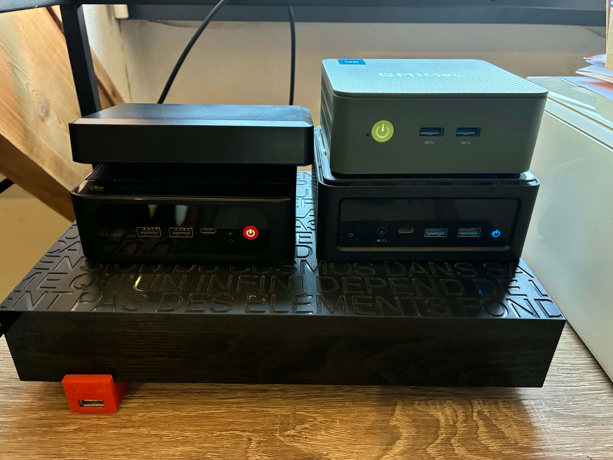

**Full repo (GitOps, feel free to clone and explore): [mathisdlmr/k3s-project](https://github.com/mathisdlmr/k3s-project)**

### Architecture - Geographic HA

The HA k3s cluster runs across **3 little computers (NUCs)** spread across **2 different homes**, interconnected using a **Tailscale** (VPN) mesh. Cilium routes its inter-pod **VXLAN** network through this Tailscale tunnel, and **etcd** handles distributed consensus with automatic snapshots every 6 hours. Longhorn is also set up to replicate volumes across every node, so storage stays accessible even if a node goes down.

PS: _The 3 NUCs were originally all at my parents' place, hence the photo above, but I later moved 2 of them to my apartment in Compiègne_

On my machine, a **local HAProxy** round-robins across the 3 control planes for HA access to the API server: if one node goes down, `kubectl`, ArgoCD, and all my other services keep running without interruption.

### Setup - A DevOps Approach

For the cluster, I went with a DevOps approach that's fully reproducible in just a few minutes.

The cluster is first bootstrapped by Ansible, which runs on my laptop and configures each NUC to become a (secured) node

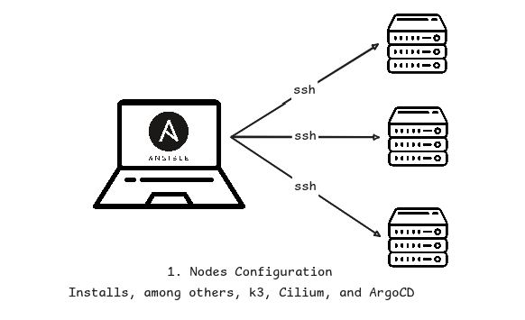

Once the setup is complete, this is the resulting architecture:

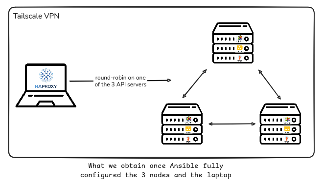

The next step is installing an ArgoCD application that takes over management of the ArgoCD instance installed by Ansible, and handles deploying the rest of the repo through the `meta` application

Finally, all that's left is to pull in the secrets. For that, I create a Kubernetes secret called `infisical-universal-auth-credentials`, which lets External Secrets Operator authenticate with Infisical and then recreate every secret defined in the repo (logins, Cloudflare tunnel, etc.)

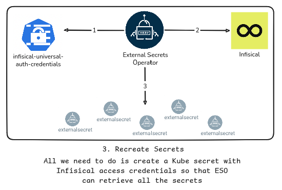

And there it is, the cluster is rebuilt from scratch!

The services are then reachable online at `https://mdlmr.fr/*`. And for a bit more visibility into how that works, here's one last diagram ;)

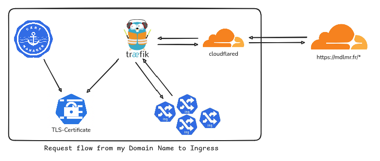

### Maintenance - CI/CD and GitOps

The cluster is driven by **ArgoCD** following a multi-level *app-of-apps* pattern (with sync-waves to guarantee deployment order: ArgoCD itself and its CRDs first, then infra, then monitoring, then the apps), and by **Renovate**, which automatically opens PRs to update Helm charts and Docker images (auto-merged for minor updates, manually reviewed for major ones).

A GitHub Actions workflow, **Argo Diff Preview**, generates the full manifest diff (rendered Helm + Kustomize) and posts it as a comment on every PR. Handy for seeing the impact before merging :)

  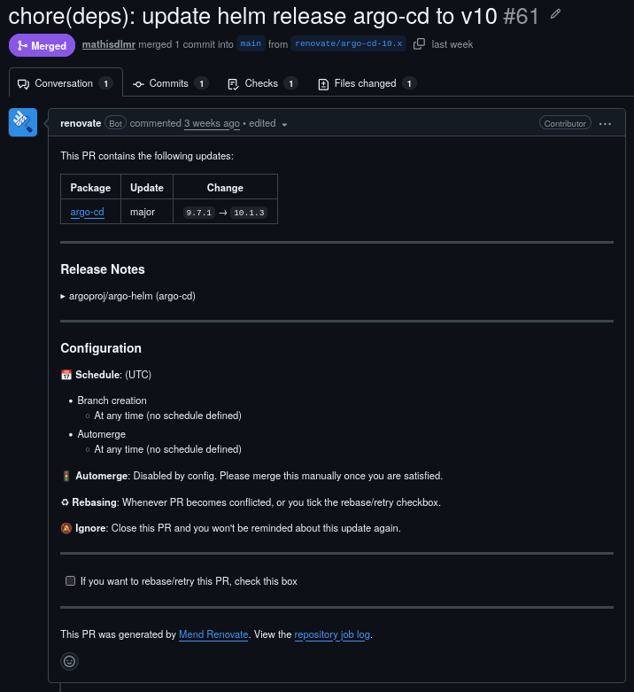
  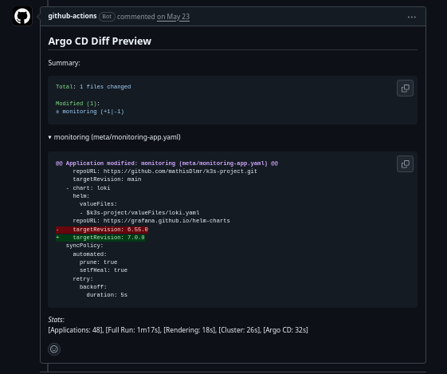

### Full Observability

Observability is handled by 2 complete stacks:
* The Prometheus and Grafana Labs stack (Prometheus, Grafana, Alloy, Loki, Tempo), as well as
* The EFK stack (Elasticsearch, Fluent, Kibana) - Victoria Metrics - OTel

Both monitoring stacks collect logs and metrics from all deployed services, while the tracing system is currently only used for the Ski'UT backend, where I implemented the OTel SDK to collect traces and inspect particularly slow requests (the bottleneck was usually database connection pooling or poorly factored Eloquent ORM operations).

The point of running 2 monitoring stacks is purely for learning purposes, so I'm comfortable with the Grafana Labs stack as well as other widely used tools (Elasticsearch, Fluent, etc.). Along those lines, I'm also planning to add Mimir and/or Thanos IO to my stack soon, along with Datadog.

### Real-World Results

In January 2026, this cluster handled load spikes in production from the Ski'UT booking mini-game - **averaging around 150 req/s and peaking at 200 req/s** - absorbed thanks to a Cloudflare cache configured on storage (mainly images, CSS, and JS), Traefik running as a DaemonSet in front of the cluster, and load balancing tuned by an HPA that could scale from 1 to 3 backend containers under heavy load.

Under normal circumstances, the server also hosts my personal services (Affine as a Notion-like tool, Immich for photos, my personal website, etc.).

---

##  Student Association Life at UTC

> [!TIP]
> Projects are listed in chronological order — the further down you go, the better ;)

### Integ Fev *(Spring 2024)*

Took over, debugged, and updated (new features, new design) a **Flutter** mobile app and a **Laravel** backend for a 1.5-week orientation week. The app was used by around a hundred students and was used to run activities and manage the organization of orientation week.

---

### Integ *(Fall 2024)*

Took over, debugged, and updated an **Expo** mobile app and a Laravel backend for a 2-week orientation program. The app was used by more than 1,000 students and had even more features than the Integ Fev app: meal booking, virtual queueing, shuttle booking, QR code scanning, and more.

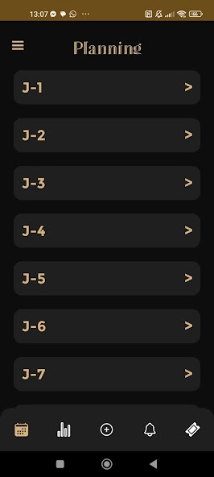
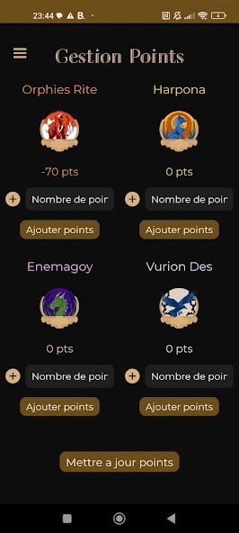
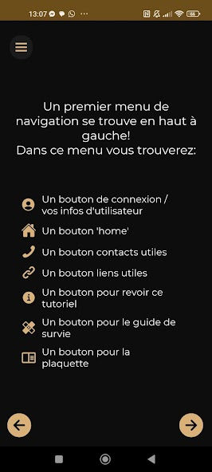
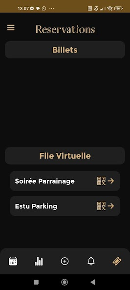
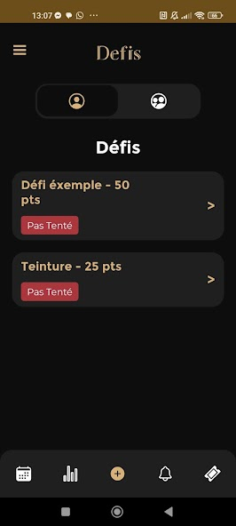
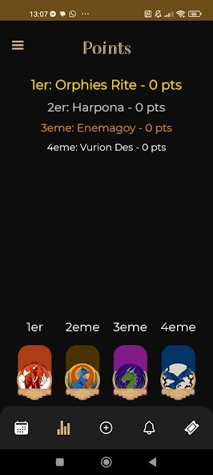

_These screenshots are from the version of the app I started working on, where I fixed bugs and added features. The initial development was done by Géo SAGLIO the year before I joined the association. Unfortunately, I wasn't able to track down older versions of the project, since the repository is private and I don't have a local copy..._

---

### [Ski'UT](https://github.com/ski-utc) *(March 2024 → Feb. 2025)*

Built from scratch (with my roommate at the time, Eric BJARSTAL) an **Expo** mobile app and a **Laravel** backend to organize a ski trip for ~500 students and run activities throughout the week.

- **Backend**: [ski-utc/server-skiut-2026](https://github.com/ski-utc/server-skiut-2026) - Laravel/Filament server handling the entire trip organization (auth via the student union's IT department OAuth 2.0, bookings, schedule, shuttles, etc.)
- **Mobile app**: [ski-utc/app-skiut-2026](https://github.com/ski-utc/app-skiut-2026) - Expo app with challenges, schedule, fun facts, resort map, shuttles, push notifications, GDPR export/anonymization, etc.

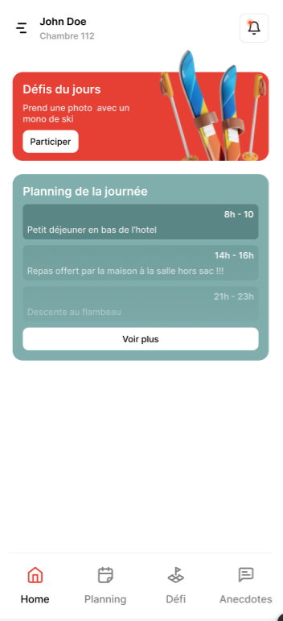
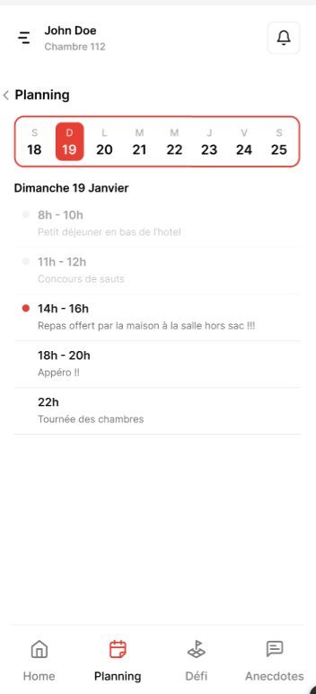
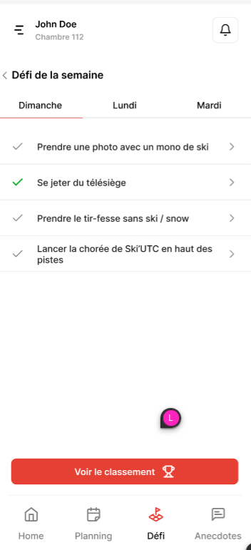

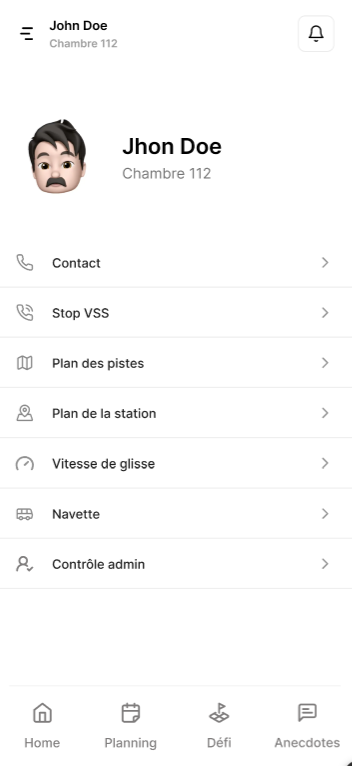

<a href="./files/skiut2025.pdf">View the project presentation</a>

---

### [Ski'UT V2](https://github.com/ski-utc) *(March 2025 → Feb. 2026)*

Took the project back over, this time solo, to stabilize it and make it sustainable long-term:

- CI/CD for both frontend and backend (dockerization + backend unit test pipeline, ESLint + Prettier for the frontend)
- Deployed the backend in self-hosted Docker containers on my personal Kubernetes cluster *(→ see the [k3s Homelab](#flagship-project---self-hosted-kubernetes-homelab-k3s-project) section above)*
- Integrated metrics and traces into the backend, collected by the cluster's Alloy agent
- Wrote documentation explaining how the project works and the best practices to follow

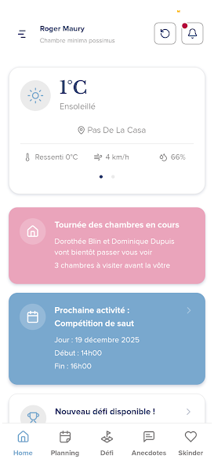
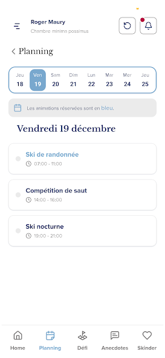
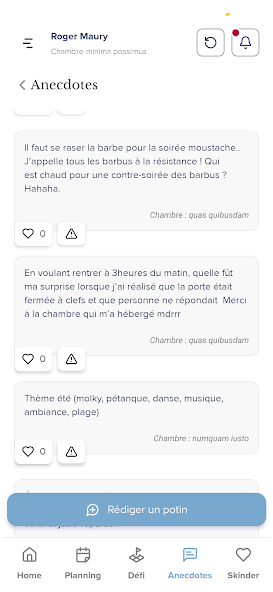
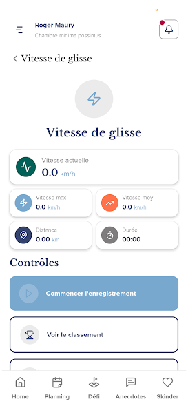
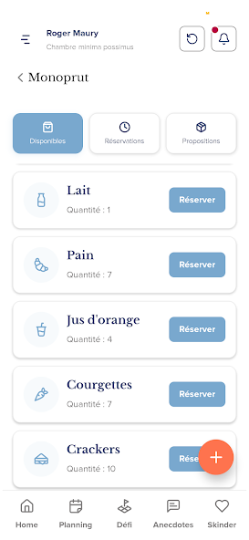
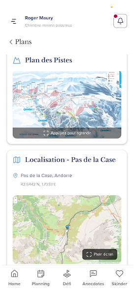

The project has since been running entirely on my Kubernetes cluster.

---

### [The Pic'Asso](https://github.com/picasso-utc) *(Spring 2025, Fall 2026)*

UTC's student bar and common room. I worked on maintaining the IT systems and developing new features for the treasury and events teams (Spring 2025):

- **Ocktopus** - [picasso-utc/ocktopus](https://github.com/picasso-utc/ocktopus): Laravel/Filament backend for organizing the association and treasury services, plus an API for a future mobile app
- **Bach** - [picasso-utc/bach](https://github.com/picasso-utc/bach): a React-based payment kiosk installed on Raspberry Pis connected to an NFC badge reader, which reads student card UIDs through a Java applet running on the Pi, so the React app can finally process the sale through the "Weezpay" service
- Overhauled the documentation, updated the projects, and migrated the sales kiosks and display screen from Raspberry Pi 3 to Raspberry Pi 5

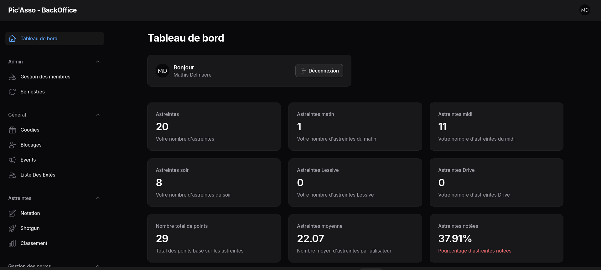
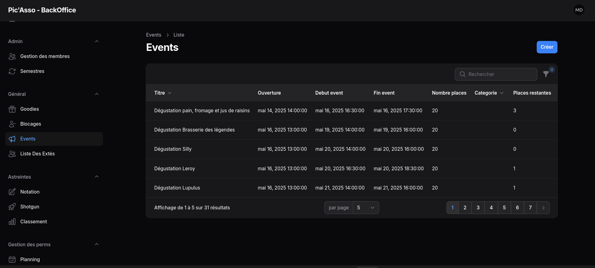

<!-- TODO: screenshots/photos of other Ocktopus screens, the physical payment kiosks (rasp+badge reader), etc. -->

---

### [SiMDE](https://assos.utc.fr/simde/) *(Spring 2025, Spring 2026)*

IT Department of the Student Union - hosting and infrastructure for the 100+ associations in the BDE-UTC federation.

- **UTCats**: Filament webapp for managing CATs - [mathisdlmr/UTCats](https://github.com/mathisdlmr/UTCats)
- Debugging and development on infrastructure projects (mostly private)

---

### President of Le Pic'Asso *(February 2026 → July 2026)*

Elected president of Le Pic'Asso, UTC's student bar and common room, for a 6-month term leading a team of 25 people.

- Main point of contact with the student union's presidency, the school administration, the health and safety department (SHS), and the fire department
- Managed facility-related projects: planning, grant applications, construction follow-up
- Worked on CSR issues, community living standards, non-discrimination, and combating sexual and gender-based violence
- Provided individual support to association members to ensure their well-being and the smooth running of the common room
- Organized near-weekly events, each with its own safety file
- Oversaw logistics (~1,000L of beer, 125 sandwiches and 250 pastries per week, 400 cans of soft drinks) and the related supplier relationships
- Maintained the premises and IT systems, supported the association's communications, etc.

---

##  Coursework Projects

> [!TIP]
> Most of these repos include a Makefile and/or a Dockerfile. Feel free to try them out!

| Course | Year | Project | Description | Stack | Link | Other |
|---|---|---|---|---|---|---|
| **API Init, Introduction to Linux** | Fall 2023 | Space Invaders | Terminal-based Space Invaders game | `Bash` | [mathisdlmr/Space-Invaders](https://github.com/mathisdlmr/Space-Invaders) | - |
| **IC05, Critical Analysis of Digital Data** | Spring 2024 | Letterboxd Scraper | Letterboxd scraper → PostgreSQL, followed by data cleaning and analysis in Python | `Python` · `PostgreSQL` | [mathisdlmr/ic05](https://github.com/mathisdlmr/ic05) | <a href="./files/ic05.pdf">View the project report</a> |
| **NF18, (Non-)Relational Database Design** | Spring 2024 | Database Project | Airport database modeled in both relational and non-relational form, implemented in PostgreSQL | `PostgreSQL` · `Python` | [mathisdlmr/nf18](https://github.com/mathisdlmr/nf18) | - |
| **SR04, Networks** | Fall 2024 | Research Paper | Research on IoT for healthcare | `BLE` · `Zigbee` · `AMQP` · `MQTT` · `CoAP` | <a href="./files/sr04-rapport.pdf">View the project report</a> | <a href="./files/sr04-presentation.pdf">View the project presentation</a> |
| **SR10, Introduction to Web Development** | Spring 2025 | Recruitment Platform | LinkedIn-style webapp - managing job postings, applications, and organizations, with admin/recruiter/candidate roles | `Express.js` · `EJS` · `SQLite` | [mathisdlmr/sr10](https://github.com/mathisdlmr/sr10) | - |
| **IA02, Algorithmic Problem Solving** | Spring 2025 | Algorithmic Tic-Tac-Toe Solver | Implementation of an MCTS to solve the game of tic-tac-toe | `Python` | [mathisdlmr/ia02](https://github.com/mathisdlmr/ia02) | - |
| **TX, Project** | Fall 2025 | Management Platform | Filament webapp for UTC's tutoring program | `Laravel` · `Filament` | [mathisdlmr/Tutut](https://github.com/mathisdlmr/Tutut) | - |
| **SR03, Web Application Architecture** | Spring 2026 | Multi-user WebSocket Chat | Chat application with an admin panel, temporary rooms, voice messages, photos, and file sharing | `Spring Boot` · `React` · `WebSocket` | [mathisdlmr/sr03](https://github.com/mathisdlmr/sr03) | - |
| **SR05, Distributed Systems** | Spring 2026 | Distributed Werewolf | Decentralized werewolf game implementing distributed mutual exclusion and snapshots (vector clocks) | `Go` | [mathisdlmr/sr05](https://github.com/mathisdlmr/sr05) | <a href="./files/sr05.pdf">View the project presentation</a> |

---

### Appendix: PHITECO

_Beyond computer science courses, I also took a number of courses in cognitive science, as well as on the relationship between technology and cognition. In terms of qualifications, this corresponds to earning the [PHITECO](https://sites.google.com/site/mineurphiteco/) minor (PHIlosophy, TEchnology and COgnition) alongside my degree._

> "PHITECO offers scientific, philosophical, and practical tools for understanding how technology transforms the way we think, perceive, reason, act, and interact. The minor introduces engineering students to the major theoretical and practical questions of cognitive science."

To give a simple example of what PHITECO covers, you'll find [here]("./files/sc01.pdf") a paper I wrote with my classmate Lysandre FINTA--LAURENT for the PHITECO minor seminar. The paper examines how psychiatric classification systems (DSM-V, ICD, RDoC, etc.) affect their own use across different application fields (insurance, education, research, etc.). The paper's throughline draws on Jack GOODY's work on graphic reason and Bruno BACHIMONT's work on computational reason: writing and computing are not neutral tools — they shape the range of what's possible in terms of action and cognition.

---

##  Hackathons

### CultureXP *(February 2025 - GottaGoHack, Epitech)*

A mobile app that gamifies cultural discovery: a map of cultural venues (via OpenStreetMap), quests, podcasts (via PodcastIndex), books (via the Google Books API), and a shop to spend earned XP. Built in 48 hours.

**Stack**: `Expo` · `React Native` · `TypeScript`
→ [mathisdlmr/CultureXP](https://github.com/mathisdlmr/CultureXP)

<a href="./files/culturexp.pdf">View the project presentation</a>

---

### Aide-un-étudiant *(July 2025 - UTC x mc2i)* -  1st Place

A local peer-to-peer support platform for students: item lending, service exchange, knowledge sharing. Designed with accessibility and eco-design in mind (Server Components, optimized Prisma queries, static rendering, Positive Impact Score).

**Stack**: `Next.js` · `TypeScript` · `Prisma` · `TailwindCSS` · `NextAuth.js`
→ [mathisdlmr/hackhaton-utc-mc2i](https://github.com/mathisdlmr/hackhaton-utc-mc2i)

<a href="./files/aide-un-etu.pdf">View the project presentation</a>

---

##  Stack & Technologies

### Programming Languages

### Web Frameworks & Libraries

### DevOps & Infrastructure

### Observability

<!-- TODO : Victoria Metrics -->

### Databases

### Cloud & Networking

_Coming soon:_
* _Associations: Pic A26? TX Kubernetes?_
* _Projects: Cyber-resilience in SR07? Cloud in SR08?_

---

##  Contact

- **Email**: [mathis.dlmr@gmail.com](mailto:mathis.dlmr@gmail.com)
- **LinkedIn**: [linkedin.com/in/mathis-delmaere-6a6325325](https://www.linkedin.com/in/mathis-delmaere-6a6325325/)
- **GitHub**: [github.com/mathisdlmr](https://github.com/mathisdlmr)
- **Location / mobility**: open to relocating internationally or working in France with international teams
- **Languages**: French (native), English (C1)

---

Thanks for stopping by!
